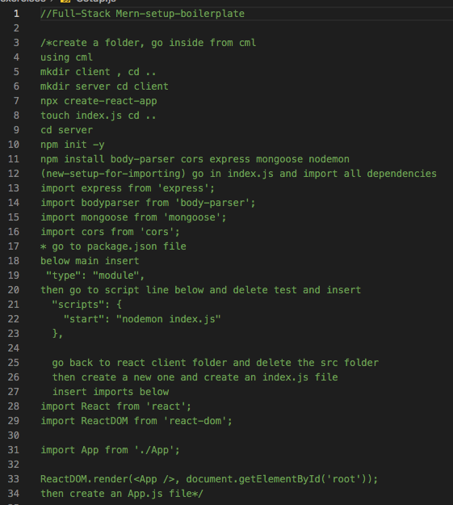

# memories_project

From the youtube-tutorial with detailed comments.

This full-stack mern app uses React and Node, Express.js with MongoDB. The purpose of this app is to display CRUD restful-routes with a full-stack app.

Also this app is using the latest setup with MongoDB atlas due to the previous version no longer being supported on heroku deployment.

